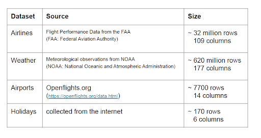
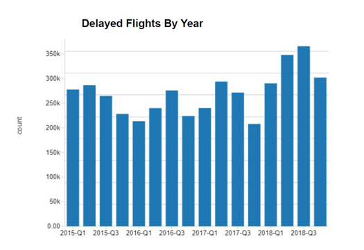
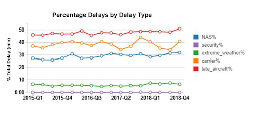
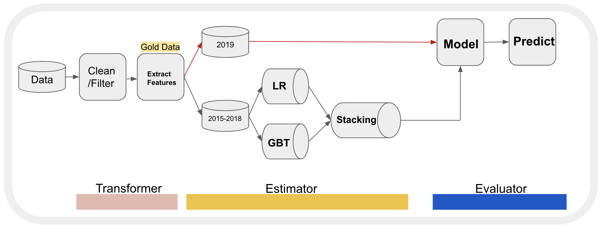
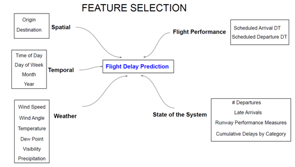

Flight delays create scheduling problems for airlines and airports, leading to passenger inconvenience, and huge economic losses. 

As of 2017, about 1 in 5 US flights were delayed by more than 15 minutes resulting in an aggregate economic toll of $26.6 billion. Almost half of which was charged to travelers.

Passengers suffer loss of time, missed business and leisure opportunities. 
Airlines suffer loss of business, increased labor and fuel costs in addition to negative environmental impacts. 

As a result there is a growing interest in predicting flight delays beforehand, to help optimize operations and improve customer satisfaction. 
This project presents a machine learning model that we developed using individual flight and location specific meteorological data for predicting flights that might suffer departure delays exceeding 15min.

