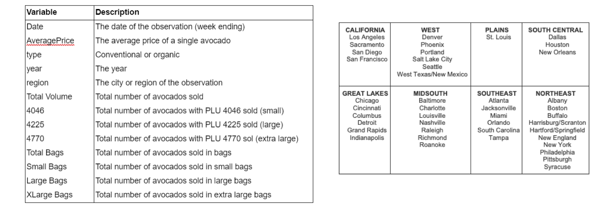
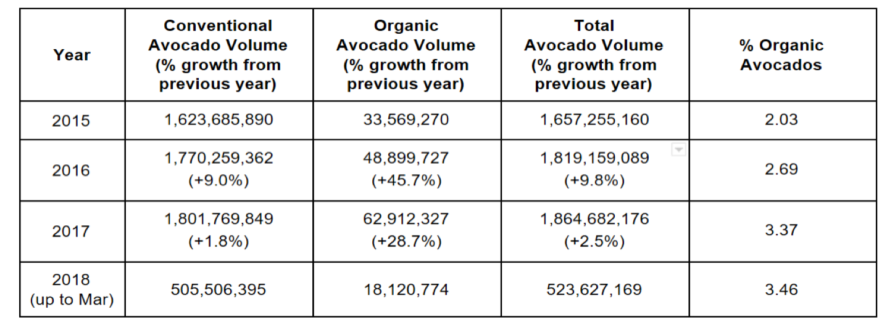
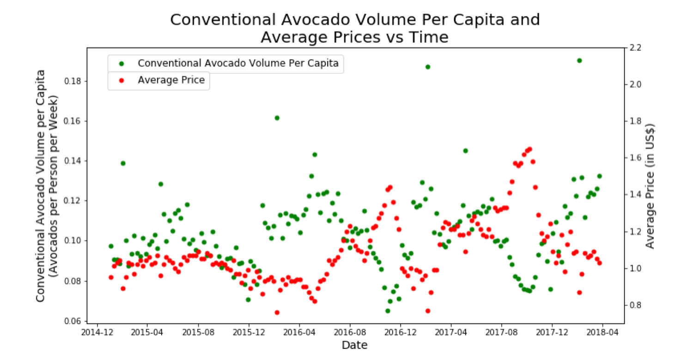
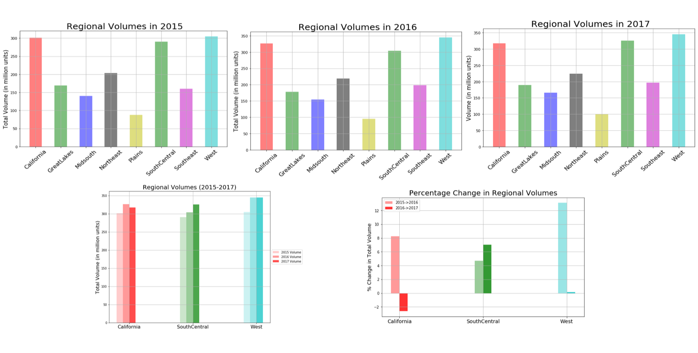
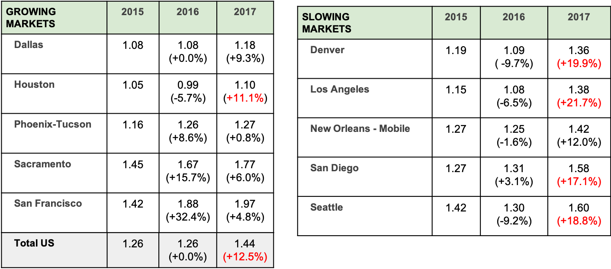

## Avocado Market Entry Analysis

Avocados have conquered the American palate. Avocados are consumed in virtually every corner of the country. They have become increasingly common in restaurants, food chains and supermarkets. 

In this Python based project, we explore trends in the demand of the popular Haas variety of avocados in order to identify the best markets for new distributors. 

3 year historic data on avocado prices and volumes in multiple U.S. markets, published by the Haas Avocado Board (https://hassavocadoboard.com/) was obtained from Kaggle.com for the years 2015-2018. 
https://www.kaggle.com/neuromusic/avocado-prices. The data comprised 18k rows and 13 columns. 

Population data for regions was obtained from Haver Analytics.

## Final Recommendations

* The South Central region presents the best opportunities

* Avocado markets are price sensitive- prices should be maintained near the national average

* Growth of organic avocado consumption is a growing niche
